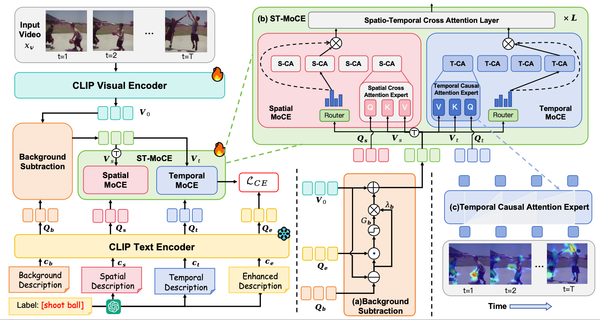

<h2> <center> MoCE: Text-Driven Spatio-Temporal Mixture of Cross-modal Experts and Background Subtraction for Video Action Recognition </center> </h2>


</div>

## Overview

Official implementation of our **MoCE**.




## Data Preparation

#### Dataset

- For downloading the Kinetics-400&600 datasets, you can refer to [mmaction2](https://github.com/open-mmlab/mmaction2/blob/master/tools/data/kinetics/README.md) or [CVDF](https://github.com/cvdfoundation/kinetics-dataset). 
- For [UCF-101](https://www.crcv.ucf.edu/data/UCF101.php) and [HMDB-51](https://serre-lab.clps.brown.edu/resource/hmdb-a-large-human-motion-database/), you can  get them from the official website.
- We rescale all videos to height=256 pixels, it is not necessary, but it will save a lot of memory storage space and fast IO speed.

#### Video Loader

By default, we decode the videos on the fly using [decord](https://github.com/dmlc/decord). 

<details><summary>Example of annotation</summary>


```sh
  abseiling/aaa.mp4 0
  abseiling/bbb.mp4 0
```

</details>


## Training

By default , we train our model on Kinetics-400 in a *Single Machine*.

```bash
bash bash scripts/run_train.sh configs/hmdb51/hmdb_train.yaml
```

## Testing
**Close-set evaluation.** We adopt single-view (1 x 1 views)  8 frames per view.

```bash
# Single-view evaluation
bash scripts/run_test_zeroshot.sh configs/hmdb51/hmdb_test.yaml xxx/model_best.pt --test_clips 1

```

## 📌 BibTeX & Citation

 If our work is useful to you, please consider citing our paper using the following BibTeX entry.


```bibtex

```

## Acknowledgement

Our code builds on [BIKE](https://github.com/whwu95/BIKE), [CLIP](https://github.com/openai/CLIP) and [MoTE](https://github.com/ZMHH-H/MoTE.git). Thank them for their excellent works!
